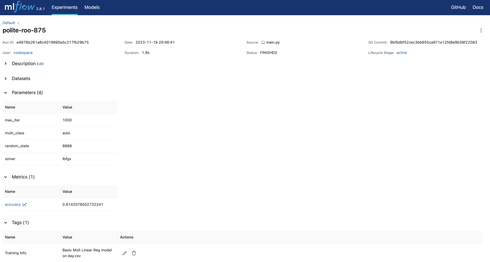
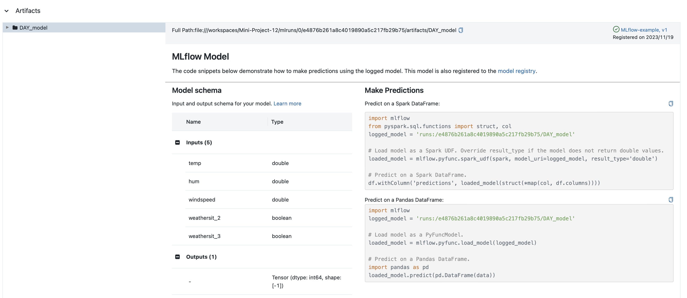

# Data Engineering Systems: Mini Project 12

This project focuses on MLflow as a way to log and track machine learning models. Ultimately, this lab uses MLflow to manage a machine learning project. 

I chose to create a simple logistic regression machine learning model to show the benefits of using MLflow.

The following steps are followed in completing this lab: 
1) Create a simple machine-learning model
2) Use MLflow to manage the project, including tracking metrics

## Machine Learning Model

I conduct simple logistic regression analysis on the bike sharing data set provided by University of California, Irvine. The data set description is available at <https://archive.ics.uci.edu/ml/datasets/bike+sharing+dataset>, and the data set can be downloaded at <https://archive.ics.uci.edu/ml/machine-learning-databases/00275/Bike-Sharing-Dataset.zip>.

**Processing:** 

* I created a "demand" flag variable based off of `cnt` that flags the demand as high if there are over 4000 instances of a bike being used on a single day. 
* I created a weather situation flag variable. The weather situation variable had the codeframe of 1 = sunny, 2 = windy, 3 = rainy and 4 = . The dummy variables allow us to use this variable more accurately as parameters in this model.

**Logistic Model:**

* Features: temperature, humidity, windspeed, weather situation dummies
* Target: demand

**Model Training and Testing:**
* Split the data into training and testing sets 
    * Data is split based on random sampling where 75% of the data is Training, and 25% is Test data
* Train the model on the training set
* Predict the target values using the model on the test set (this is reported as accuracy)  

**MLflow Integration:**
* Use MLflow to log parameters, metrics, and the trained model.
* Log all parameters that are identified in the `params` dictionary.
* Log metrics like accuracy of predicting the test set.

**DevOps:**
* Makefile is included to test formatting and linting (run `make format`, `make lint`, and `make test`)

## Running the code:
1. Open Codespaces or clone this repository
2. run make install, if necessary
3. Run the machine learning algorithm by running: `python main.py`
4. Run `mlflow ui` and open browser tab to view mlflow's user interface (ctrl-c will close this process within the terminal)
5. Saved model, artifacts, parameters etc. are found in the mlruns folder for your review

**MLflow UI Example screenshots**

